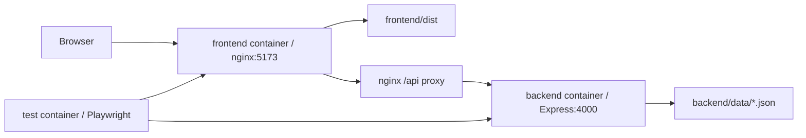
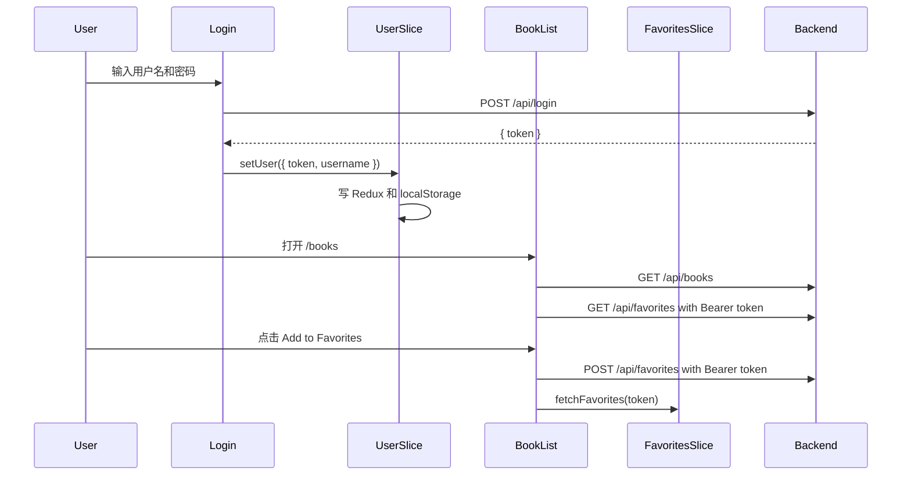

# Book Favorites 架构说明

本文只基于本次代码变更整理，目标是让第一次接触项目的人能快速理解运行形态、代码结构、模块依赖和常见修改入口。

## 1. 应用概览

Book Favorites 是一个前后端分离的图书收藏应用：

- 前端：Vite + React + TypeScript + Redux Toolkit，负责页面路由、登录态、图书列表、收藏列表和用户交互。
- 后端：Express + TypeScript REST API，负责注册、登录、图书查询、收藏读写和 JWT 鉴权。
- 数据层：没有数据库，后端同步读写 `backend/data/*.json`。
- 测试：后端使用 Jest + Supertest，端到端测试使用 Playwright。
- Infra：支持本地 npm 启动，也支持 Docker Compose 编排 backend、frontend 和 test 三个服务。

## 2. Infra 与运行结构

### 2.1 本地开发模式

本地开发时通常启动两个进程：

```text
npm run start:backend    # backend workspace: build 后运行 dist/server.js
npm run start:frontend   # frontend workspace: 启动 Vite dev server
```

请求链路如下：


`frontend/vite.config.ts` 默认把 `/api` 代理到 `http://localhost:4000`，可以用 `VITE_API_PROXY_TARGET` 覆盖。`frontend/src/api.ts` 默认使用同源 `/api`，也可以用 `VITE_API_BASE_URL` 覆盖。

### 2.2 Docker Compose 模式

`docker-compose.yml` 定义了三个服务：

| Service | Build file | 端口/职责 | 关键点 |
| --- | --- | --- | --- |
| `backend` | `dockerfile-backend` | 容器内 `4000` | 构建 TypeScript 后运行 `backend/dist/server.js`，暴露 `${BACKEND_HOST_PORT:-4000}:4000` |
| `frontend` | `dockerfile-frontend` | 容器内 `5173` | 构建 Vite 静态文件，用 nginx 托管，暴露 `${FRONTEND_HOST_PORT:-5173}:5173` |
| `test` | `dockerfile-test` | 不暴露端口 | 使用 Playwright 镜像运行 `run-e2e.sh`，依赖 backend 和 frontend 健康检查 |

容器运行链路如下：



`nginx.conf` 负责两件事：

- `location /` 使用 `try_files $uri $uri/ /index.html` 支持 React 前端路由刷新。
- `location /api` 和 `location /api/` 代理到 `http://backend:4000/api`。

Compose 中 backend 的健康检查访问 `http://127.0.0.1:4000/api/books`，frontend 的健康检查访问 `http://127.0.0.1:5173/`。test 服务设置 `E2E_USE_EXTERNAL_SERVICES=1`，所以 `run-e2e.sh` 不再自行拉起本地服务，而是直接测试 Compose 已启动的 backend 和 frontend。

### 2.3 构建镜像职责

- `dockerfile-backend`：先在 builder stage 执行根级依赖安装和 `npm run build:backend`，运行阶段只安装 backend 生产依赖，复制 `backend/dist` 和 `backend/data`。
- `dockerfile-frontend`：builder stage 执行 `npm run build:frontend`，运行阶段使用 `nginx:1.27-alpine` 托管 `frontend/dist`。
- `dockerfile-test`：基于 Playwright 官方镜像，安装根 workspace 依赖，复制前端测试和 `run-e2e.sh`。

## 3. 仓库代码结构

```text
.
├── package.json                 # npm workspaces 和根级脚本
├── docker-compose.yml           # backend/frontend/test 服务编排
├── dockerfile-backend           # 后端生产镜像
├── dockerfile-frontend          # 前端 nginx 镜像
├── dockerfile-test              # Playwright 测试镜像
├── nginx.conf                   # 前端静态托管和 /api 反向代理
├── run-e2e.sh                   # Playwright E2E 启动器
├── backend/
│   ├── server.ts                # Express runtime 入口
│   ├── types.ts                 # 后端共享类型和 Express Request 扩展
│   ├── tsconfig.json            # 后端含测试的类型检查配置
│   ├── tsconfig.build.json      # 后端生产构建配置
│   ├── jest.config.js           # Jest + ts-jest 配置
│   ├── data/                    # books/users 以及 test-* JSON 数据
│   ├── routes/                  # API router factories
│   └── tests/                   # Jest + Supertest API 测试
└── frontend/
    ├── index.html               # Vite HTML 入口
    ├── vite.config.ts           # Vite dev server、proxy、preview 配置
    ├── playwright.config.ts     # Playwright E2E 配置
    ├── tsconfig.json            # 前端 TypeScript 配置
    ├── src/
    │   ├── main.tsx             # React mount 入口
    │   ├── App.tsx              # Provider、Router、页面路由
    │   ├── api.ts               # API URL 构造
    │   ├── types.ts             # 前端共享类型
    │   ├── components/          # 页面和导航组件
    │   ├── store/               # Redux Toolkit store 与 slices
    │   └── styles/              # CSS Modules 和全局样式
    └── tests/e2e/               # Playwright E2E 测试
```

## 4. 后端架构

### 4.1 后端模块依赖

后端依赖方向是：

```text
backend/types.ts
  -> backend/routes/*.ts
  -> backend/routes/index.ts
  -> backend/server.ts
```

`types.ts` 定义 `Book`、`User`、`AuthenticatedUser`、`AuthenticateToken` 和 `RouterDeps`，同时扩展 `Express.Request.user`。路由模块只依赖这些类型和注入进来的能力，不直接拥有全局数据路径。

### 4.2 Runtime 入口

`backend/server.ts` 负责 runtime 组装：

1. 创建 Express app。
2. 启用 `cors()` 和 `bodyParser.json()`。
3. 根据 `TEST_MODE === '1'` 选择正式数据文件或测试数据文件。
4. 在测试模式下，如果测试 JSON 不存在，则从正式 JSON 复制一份。
5. 定义 `readJSON`、`writeJSON` 和 `authenticateToken`。
6. 调用 `createApiRouter(...)`，把依赖挂载到 `/api`。
7. 监听 `PORT`，默认 `4000`。

路由依赖注入关系：

```text
server.ts
  createApiRouter({
    usersFile,
    booksFile,
    readJSON,
    writeJSON,
    authenticateToken,
    SECRET_KEY,
  })
    -> createAuthRouter(deps)
    -> createBooksRouter(deps)
    -> createFavoritesRouter(deps)
```

这个设计让测试可以不用启动真实 server，直接创建 Express app 并传入测试文件路径、测试密钥和测试版鉴权函数。

### 4.3 API 路由

`backend/routes/index.ts` 是 API 聚合层：

- `router.use('/', createAuthRouter(deps))` 挂载注册和登录。
- `router.use('/books', createBooksRouter(deps))` 挂载图书查询。
- `router.use('/favorites', createFavoritesRouter(deps))` 挂载收藏读写。

当前接口：

| Method | Path | Auth | 行为 |
| --- | --- | --- | --- |
| `POST` | `/api/register` | 否 | 校验用户名和密码，重复用户名返回 `409`，成功写入用户并初始化 `favorites: []` |
| `POST` | `/api/login` | 否 | 校验用户名密码，成功返回 1 小时有效 JWT |
| `GET` | `/api/books` | 否 | 返回 `booksFile` 中的全部图书 |
| `GET` | `/api/favorites` | 是 | 从 JWT username 找用户，再按用户 `favorites` 过滤图书 |
| `POST` | `/api/favorites` | 是 | 校验 `bookId`，不存在于当前用户收藏时追加写入 |

### 4.4 鉴权模型

登录成功后，后端用 `jsonwebtoken` 签发 JWT：

```text
payload: { username }
expiresIn: 1h
```

受保护接口读取请求头：

```text
Authorization: Bearer <token>
```

`authenticateToken` 验证成功后会把 `{ username, iat, exp }` 写到 `req.user`。`favorites` 路由只信任 `req.user.username` 来定位当前用户。

### 4.5 数据存储

数据文件位于 `backend/data/`：

- `books.json`：正式图书数据，核心字段是 `id`、`title`、`author`。
- `users.json`：正式用户数据，核心字段是 `username`、`password`、`favorites`。
- `test-books.json`、`test-users.json`：测试数据副本。

当前没有 service/repository/database 层。路由通过注入的 `readJSON(file)` 和 `writeJSON(file, data)` 同步读写 JSON 文件。修改数据模型时，需要同时检查后端类型、路由读写、前端类型、Redux slice、组件展示和测试数据。

## 5. 前端架构

### 5.1 前端模块依赖

前端依赖方向是：

```text
frontend/src/types.ts
  -> frontend/src/api.ts
  -> frontend/src/store/*.ts
  -> frontend/src/components/*.tsx
  -> frontend/src/App.tsx
  -> frontend/src/main.tsx
```

组件通过 typed hooks 使用 Redux：

- `useAppDispatch` 提供 `AppDispatch`。
- `useAppSelector` 提供 `RootState` 类型约束。

### 5.2 启动与页面路由

入口链路：

```text
frontend/index.html
  -> frontend/src/main.tsx
    -> frontend/src/App.tsx
      -> Redux Provider
      -> BrowserRouter
      -> Header
      -> Routes
```

`App.tsx` 路由表：

| Path | Component | 说明 |
| --- | --- | --- |
| `/` | `Welcome` | 首页入口，提供注册和登录按钮 |
| `/books` | `BookList` | 图书列表，组件内检查 token，未登录导航回 `/` |
| `/favorites` | `Favorites` | 收藏列表，组件内检查 token，未登录导航回 `/` |
| `/login` | `Login` | 登录表单 |
| `/register` | `Register` | 注册表单 |
| `*` | `Navigate to /` | 未匹配路径回首页 |

受保护页面目前没有集中式 route guard，而是在 `BookList` 和 `Favorites` 的 `useEffect` 中根据 Redux token 判断。

### 5.3 API 调用

`frontend/src/api.ts` 统一构造 API URL：

```text
apiUrl('/books') -> '/api/books'
apiUrl('books')  -> '/api/books'
```

调用者分布：

- `Login.tsx` 调用 `POST /api/login`。
- `Register.tsx` 调用 `POST /api/register`。
- `booksSlice.ts` 调用 `GET /api/books`。
- `favoritesSlice.ts` 调用 `GET /api/favorites` 和 `POST /api/favorites`。

### 5.4 Redux 状态

`frontend/src/store/index.ts` 组合三个 slice：

```text
RootState
├─ user
│  ├─ token: string | null
│  └─ username: string | null
├─ books
│  ├─ items: Book[]
│  └─ status: idle | loading | succeeded | failed
└─ favorites
   ├─ items: Book[]
   └─ status: idle | loading | succeeded | failed
```

slice 分工：

- `userSlice.ts`：`setUser` 写入 Redux 和 `localStorage`，`logout` 清理 Redux 和 `localStorage`。
- `booksSlice.ts`：`fetchBooks` 拉取图书列表并更新 `books.items`。
- `favoritesSlice.ts`：`fetchFavorites(token)` 拉取收藏列表，`addFavorite({ token, bookId })` 新增收藏。

新增收藏后的同步策略在组件层完成：`BookList` dispatch `addFavorite` 后，再 dispatch `fetchFavorites(token)` 刷新收藏列表。

### 5.5 组件职责

| Component | 主要依赖 | 职责 |
| --- | --- | --- |
| `Header` | `userSlice`, `react-router-dom` | 显示标题、登录后导航、当前用户和退出按钮 |
| `Welcome` | `react-router-dom` | 首页入口，跳转注册或登录 |
| `Register` | `apiUrl`, `useNavigate` | 注册用户，成功后延迟跳转登录页 |
| `Login` | `apiUrl`, `userSlice`, `useNavigate` | 登录并保存 token/username，成功后跳转收藏页 |
| `BookList` | `booksSlice`, `favoritesSlice`, `userSlice` | 拉取图书和收藏，展示图书卡片，添加收藏 |
| `Favorites` | `favoritesSlice`, `userSlice` | 拉取并展示当前用户收藏 |

典型用户流：



### 5.6 样式组织

样式来源有三类：

- `frontend/src/index.css`：全局基础样式，由 `main.tsx` 引入。
- `frontend/src/styles/App.module.css`：由 `App.tsx` 和 `Welcome.tsx` 引入，但其中包含 `body`、`h2`、`form`、`ul`、`input`、`button` 等全局选择器。
- `frontend/src/styles/BookList.module.css`：图书列表网格、卡片、收藏标记和按钮样式。

多个组件也使用 inline style。修改 UI 时要同时确认全局 CSS、CSS Modules 和 inline style 的优先级。

## 6. 测试架构

### 6.1 后端测试

后端测试位于 `backend/tests/*.test.ts`，使用 Jest + Supertest。测试不会启动 `backend/server.ts`，而是在测试文件中创建 Express app 并挂载 `createApiRouter(...)`。

覆盖范围：

- `auth.test.ts`：注册、重复注册、登录成功/失败。
- `books.test.ts`：查询图书、确认不允许新增图书。
- `favorites.test.ts`：未登录失败、有效用户查询收藏、新增收藏、不重复收藏、缺少 `bookId` 等。

`backend/package.json` 的 `test` 脚本会先执行 `backend/tests/copy-test-data.sh`，把正式 JSON 复制到测试 JSON，再运行 Jest。

### 6.2 前端 E2E 测试

前端 E2E 位于 `frontend/tests/e2e/book-favorites.spec.ts`，使用 Playwright，配置在 `frontend/playwright.config.ts`。

覆盖范围：

- 新用户注册并登录。
- 已有用户登录、查看图书、添加收藏、查看收藏页。
- 退出登录后访问受保护页面会回到首页。

根级 `npm run test:frontend` 执行 `run-e2e.sh`。脚本默认会：

1. 写入 `logs/e2e-test.log`，或使用 `E2E_LOG_FILE` 覆盖。
2. 如果 `E2E_USE_EXTERNAL_SERVICES != 1`，设置 `TEST_MODE=1` 并启动后端和前端。
3. 等待后端健康 URL 和前端 base URL 可访问。
4. 进入 `frontend/` 执行 `npx playwright test`。
5. 退出时清理由脚本启动的进程树。

在 Docker Compose test 服务中，`E2E_USE_EXTERNAL_SERVICES=1`，所以脚本只等待并测试 Compose 提供的服务。

## 7. 常见修改入口

### 7.1 新增或修改后端 API

1. 在 `backend/types.ts` 补充必要类型。
2. 在 `backend/routes/` 新增或修改 router factory。
3. 在 `backend/routes/index.ts` 挂载新路由。
4. 如果需要新的共享能力，从 `backend/server.ts` 通过 `RouterDeps` 注入。
5. 增加或更新 `backend/tests/*.test.ts`。
6. 如果前端要调用接口，继续修改 `frontend/src/api.ts` 的调用方、相关 slice 和组件。

### 7.2 修改登录态或鉴权

重点检查：

- 后端：`backend/server.ts` 的 `SECRET_KEY` 和 `authenticateToken`。
- 后端：`backend/routes/auth.ts` 的 token 签发逻辑。
- 后端类型：`backend/types.ts` 的 `AuthenticatedUser` 和 Request 扩展。
- 前端：`frontend/src/store/userSlice.ts` 的 token/username 存取。
- 前端：`BookList.tsx`、`Favorites.tsx` 的未登录跳转。
- 测试：`backend/tests/favorites.test.ts` 的测试 token 构造。

### 7.3 修改图书列表

重点检查：

- 数据：`backend/data/books.json` 和测试副本。
- 后端：`backend/routes/books.ts`。
- 类型：`backend/types.ts`、`frontend/src/types.ts`。
- 前端状态：`frontend/src/store/booksSlice.ts`。
- 前端展示：`frontend/src/components/BookList.tsx`。
- E2E：`frontend/tests/e2e/book-favorites.spec.ts`。

### 7.4 修改收藏功能

重点检查：

- 数据：`backend/data/users.json` 的 `favorites` 数组和测试副本。
- 后端：`backend/routes/favorites.ts`。
- 前端状态：`frontend/src/store/favoritesSlice.ts`。
- 前端展示和交互：`BookList.tsx`、`Favorites.tsx`。
- 测试：`backend/tests/favorites.test.ts` 和 `frontend/tests/e2e/book-favorites.spec.ts`。

### 7.5 修改运行、构建或部署

重点检查：

- 根脚本：`package.json`。
- 本地前端代理：`frontend/vite.config.ts`。
- 后端构建：`backend/tsconfig.build.json`。
- Docker 编排：`docker-compose.yml`。
- 镜像构建：`dockerfile-backend`、`dockerfile-frontend`、`dockerfile-test`。
- nginx 代理和 SPA fallback：`nginx.conf`。
- E2E 启动和等待逻辑：`run-e2e.sh`。

## 8. 当前架构注意点

- 后端同步读写 JSON 文件，适合练习项目，不适合作为高并发数据层。
- 用户密码明文存储，JWT 密钥写在代码里；生产化前需要改为密码哈希和环境变量密钥。
- 当前没有 service/repository 层；业务逻辑主要在 route factory 中。
- 受保护路由由页面组件自行检查 token；新增受保护页面时需要复用或抽象这段逻辑。
- `favoritesSlice.addFavorite.fulfilled` 不直接更新收藏数组，UI 依赖组件再次 `fetchFavorites` 刷新。
- `TEST_MODE=1` 会使用 `test-books.json` 和 `test-users.json`，测试脚本也会复制测试数据；调试测试失败时要注意数据文件是否被测试写过。
- 前端样式混合了全局 CSS、CSS Modules 和 inline style，调整 UI 前要先定位实际生效来源。
